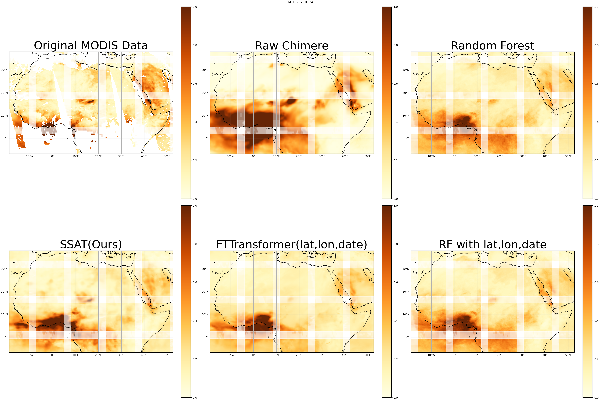
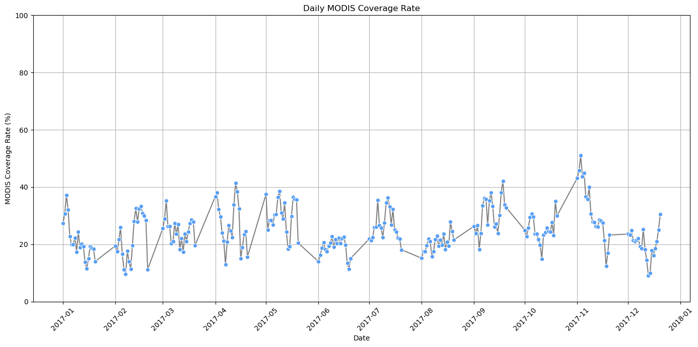
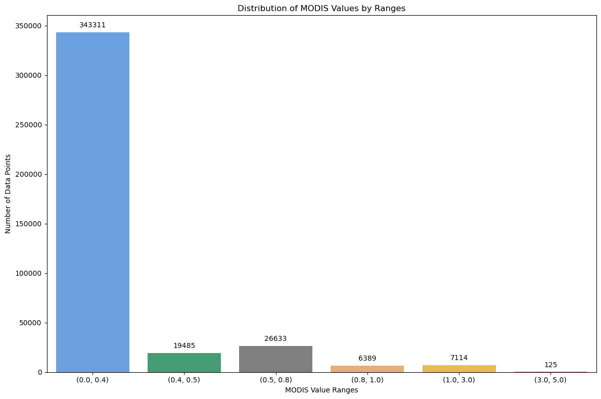

# SSAT: From Sensor data to Satellite Imaginary with Auto-Correlation Transformer for Enhanced Aerosol Optical Depth Prediction

 

## ✩️News

- [2024.11.21] - 🥨 After trying 23 models and 1200+ experiments, we achieved milestone performance.  
- [2024.07.21] - Project initiated based on https://www.mdpi.com/2184536 .  

## 🔹Pretrained Weights

We provide the pretrained SSAT weights used in our best experiments.

- ✅ Download here: [`weights/SSAT_asia.pth`](weights/SSAT_asia.pth)

Please refer to the training configuration in `parameter_exploration.py` and evaluation scripts for usage.

## ⏰ TODOs

- [ ] Release the model and inference code
- [x] Provide publicly accessible result
- [x] Provide SSAT weights
- [x] Provide reproducible parameters config
- [ ] Release tools for merging weights from community models or LoRAs
- [ ] Release SSAT-benchmark evaluation code
- [ ] Release SSAT training code

## 🛠 Configuration

All hyperparameters for our best model (Asia version) are stored in [`config/config_asia.yaml`](config/config_asia.yaml).  
This makes it easier to reproduce our results or adapt to other regions.

To reproduce the results, please refer to:
- [`weights/SSAT_asia.pth`](weights/SSAT_asia.pth)
- [`config/config_asia.yaml`](config/config_asia.yaml)

## Dataset Related Plot

### Dataset Characteristics

## 💡Methodology

SSAT is a novel architecture that integrates the strengths of FT-Transformer and Autoformer to enhance the prediction of Aerosol Optical Depth (AOD) from satellite data. This hybrid approach merges the effective representation learning capability of transformers with Autoformer's advanced temporal decomposition techniques, providing significant improvements in predictive accuracy, stability, and computational efficiency. Below, we describe the key components of SSAT, supported by mathematical formulations to elucidate the underlying mechanisms.

## 📢 Contact

For further information, please refer to the contact address provided in the paper. For issues regarding the code, you may open a GitHub issue or refer to the linked paper page once available.

